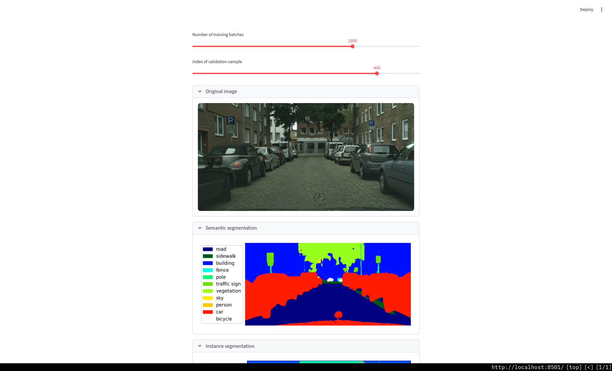
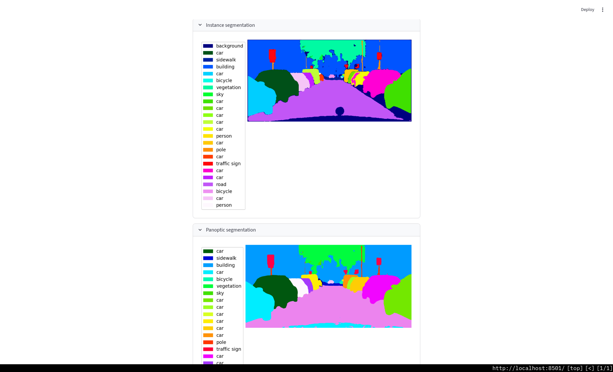
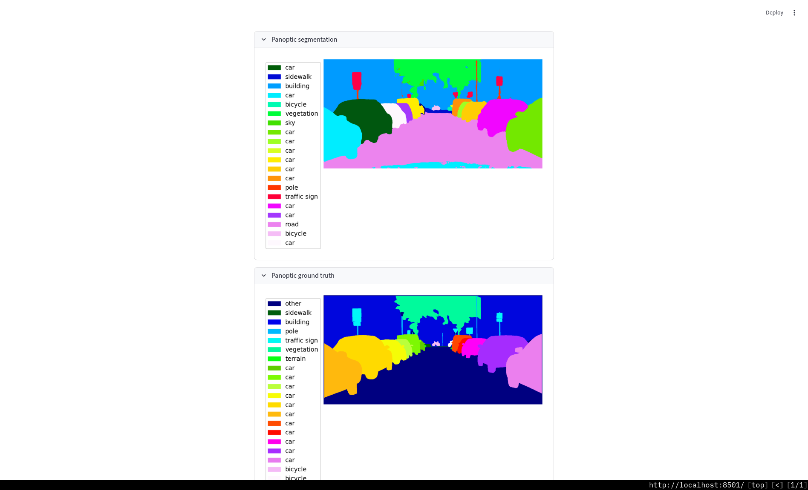

### Data preparation

Register at https://www.cityscapes-dataset.com/register/

```bash
uvx --from cityscapesscripts csDownload leftImg8bit_trainvaltest.zip gtFine_trainvaltest.zip
unzip gtFine_trainvaltest.zip
unzip leftImg8bit_trainvaltest.zip
mkdir data
mv gtFine data
mv leftImg8bit data
uvx --from cityscapesscripts csCreatePanopticImgs --dataset-folder data/gtFine/ --use-train-id
```

### Training

[`train.py`](./train.py)


### Inference

[`inference.py`](./inference.py)




