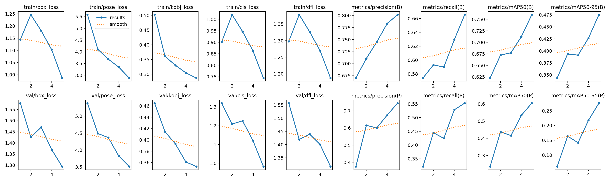
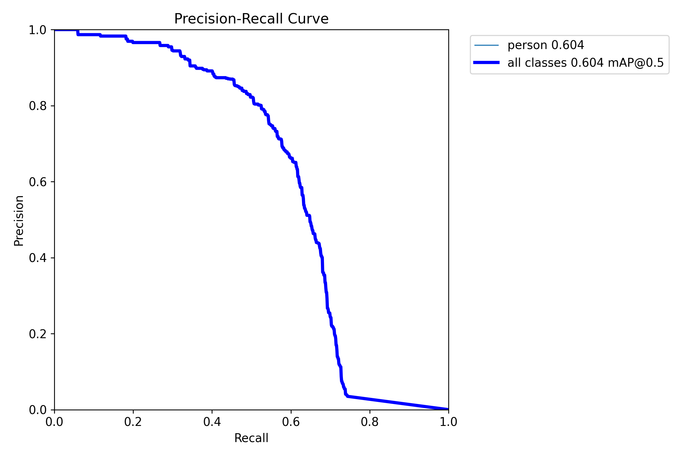
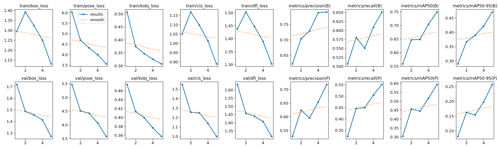
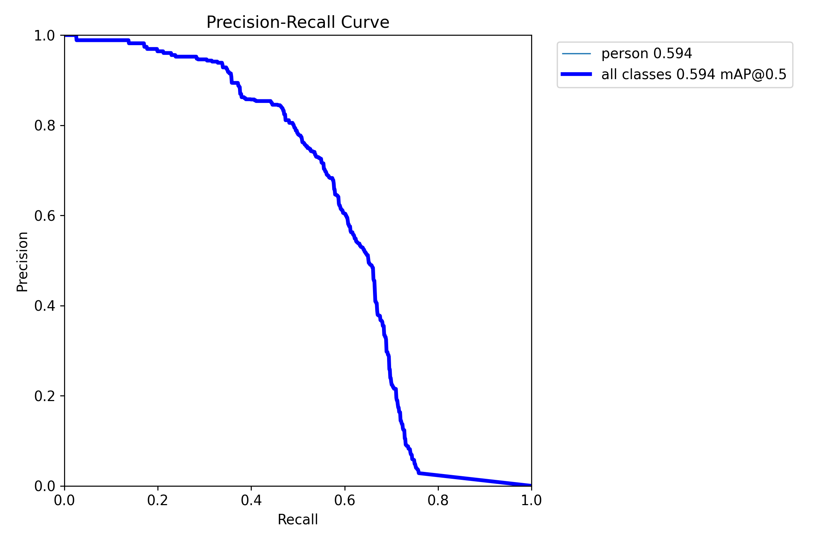
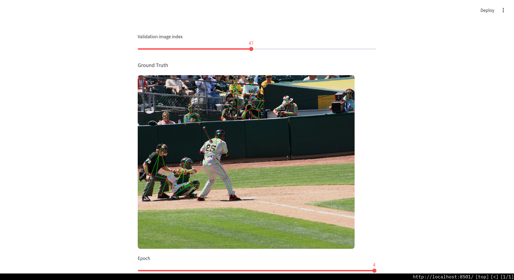
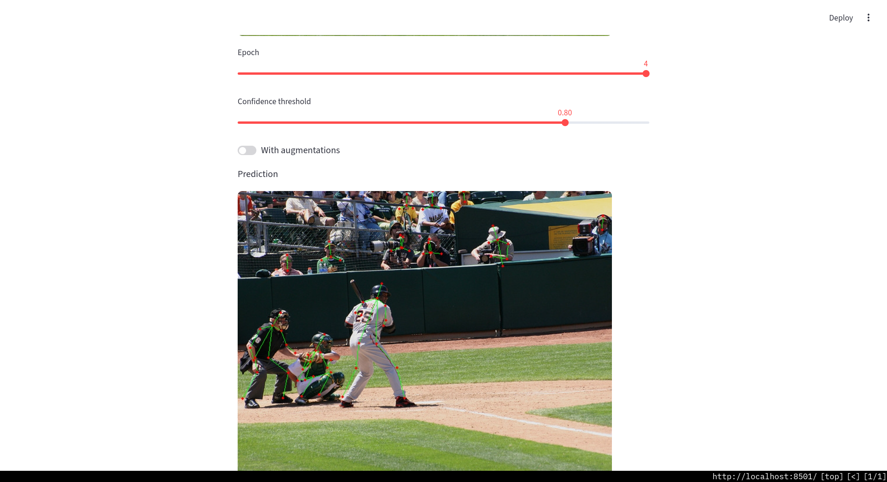
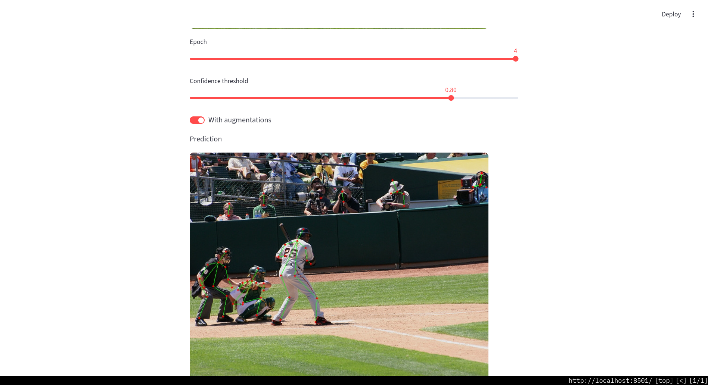

### Data preparation

https://github.com/jeffffffli/CrowdPose converted to YOLO format.

[`convert.py`](./convert.py)

### Training

[`train.py`](./train.py)

#### Without augmentations

#### With augmentations

### Inference

[`inference.py`](./inference.py)

